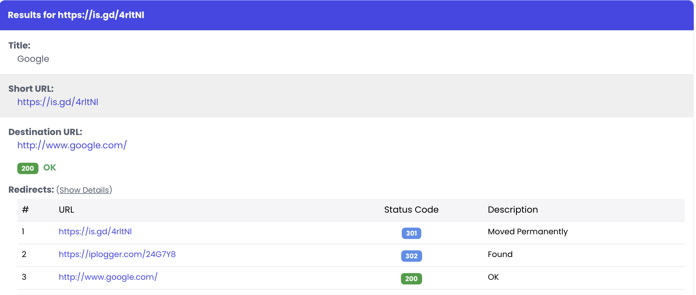
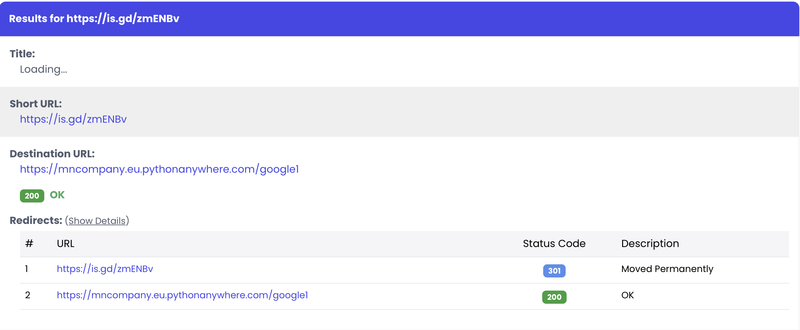

# 🛡️ Stealth URL Shortener (V8)

**The Ultimate Traffic Control System for Grey-Hat Marketing.**

Is your traffic being blocked by Facebook, Instagram, or TikTok because of "Suspicious Links"?
**Stealth Shortener** solves this by making your links look like harmless 200 OK pages to bots, while safely delivering real users to your target.

### 🆚 The Difference is Invisible

| Others (Blocked) ❌ | stealth-shortener (Safe) ✅ |
| :---: | :---: |
|  |  |
| **302 Redirect** <br> Bots see the redirect immediately and scan your destination. | **200 OK + JS** <br> Bots see a blank page. Real users are redirected instantly via JavaScript. |

## ✨ Key Features

### 👻 Stealth & Cloaking
- **HTTP 200 OK Redirects**: Uses a lightweight "Loading" page with JavaScript redirection.
- **Smart Cloaking**: Redirects suspicious traffic (Bots, VPNs) to a safe "fallback" URL (e.g., Google).
- **Bot Detection**: Double-layer detection (User-Agent + Client-Side JS).

### 🔬 Deep Technical Fingerprinting
We collect advanced hardware data to identify unique users and bots:
*   **Screen Resolution**: Width/Height (e.g., 1920x1080).
*   **Color Depth**: 24-bit/32-bit.
*   **Timezone**: Browser-reported caching zone.
*   **Keyboard Layout**: (V9) Heuristic detection of physical keyboard locale.
*   **AdBlock Status**: (V9) Detects if the user is blocking internal scripts.

### 🎭 URL Masking
- **Double Shortening**: Automatically integrates with **is.gd** to mask your domain.
- **Why?**: Even if your domain is "my-dark-store.com", users will see a generic `is.gd/xyz` link first. This adds an extra layer of anonymity and prevents direct domain flagging.

### 🌍 Traffic Filtering
- **ISP & Geo Blocking**: Native integration with `ip-api.com` to detect and block Hosting Providers/Data Centers (AWS, DigitalOcean, Hetzner, etc.).
- **VPN Protection**: Effectively filters out proxy/VPN traffic using ISP classification.
- **Device Targeting**: Route iOS and Android users to specific app store URLs automatically.

### 📊 Deep Analytics
- **Client-Side Beacons**: Captures Screen Resolution, Timezone, and Browser Capabilities without slowing down the redirect.
- **Rich Stats**: Tracks City, Country, ISP, Device Type, and Referrer.
- **CSV Export**: Full raw data export for forensic analysis.

### 🔒 Security Interstitials
- **Password Protection**: Secure SHA-256 hashed password gates.
- **Cloudflare Turnstile**: Integrated CAPTCHA to prevent automated bot traffic.

---

## 🚀 Deployment Guide (PythonAnywhere)

This project is optimized for deployment on [PythonAnywhere](https://www.pythonanywhere.com/).

### 1. Setup
1.  Create a Web App (Flask -> Python 3.10+).
2.  Open a **Bash Console** and clone your repo:
    ```bash
    git clone https://github.com/YOUR_USER/stealth-shortener.git
    cd stealth-shortener
    ```
3.  Install dependencies:
    ```bash
    pip install -r server/requirements.txt
    ```

### 2. Configuration (`.env`)
Create a `.env` file in the root directory (use `.env.example` as a template):
```bash
cp .env.example .env
nano .env
```
Fill in your details:
*   `SERVER_URL`: Your full domain (e.g., `https://myuser.pythonanywhere.com`)
*   `API_KEY`: A secret password you generate (needed for the CLI).

### 3. Database
Initialize the SQLite database:
```bash
python3 server/init_db.py
```

### 4. WSGI Configuration
Go to the **Web** tab in PythonAnywhere and edit the WSGI configuration file. Replace everything with the file provided in my repo.

### 5. Cloudflare Turnstile (Captcha)
To enable the "Not a Robot" check:
1.  Go to [Cloudflare Turnstile](https://www.cloudflare.com/products/turnstile/) and add your domain (e.g., `yourname.pythonanywhere.com`).
2.  Get the **Site Key** and **Secret Key**.
3.  Add them to your `.env` file:
    ```ini
    TURNSTILE_SITE_KEY=0x4AAAAAA...
    TURNSTILE_SECRET_KEY=0x4AAAAAA...
    ```
4.  Reload your Web App.

---

## 📦 Local Usage (CLI)

The Command Line Interface (CLI) allows you to manage links from your local machine.

### Setup
```bash
./run.sh client
```
(On first run, it will automatically create a virtual environment and install dependencies).

### Creating Links
Follow the interactive wizard to:
1.  Set destination.
2.  Enable **Targeting** (iOS/Android).
3.  Enable **Cloaking** (Safe URL for bots).
4.  Enable **Protection** (VPN Blocking, Captcha).

---

## ⚠️ Disclaimer
This tool is intended for educational and legitimate traffic management purposes. The authors are not responsible for misuse.
